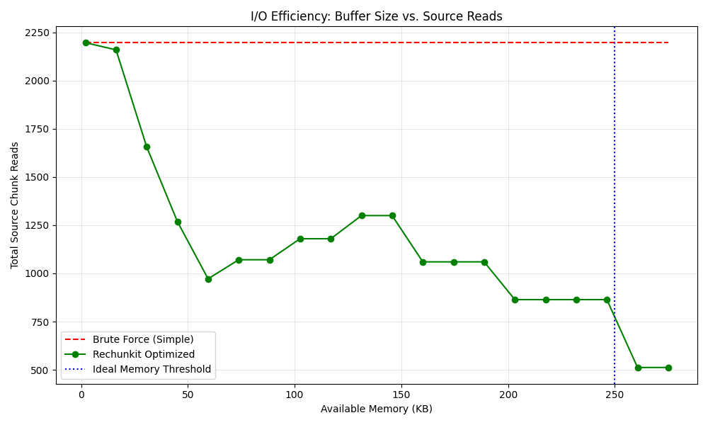
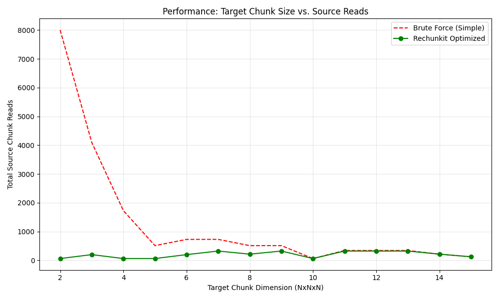

# rechunkit

<p align="center">
    <em>Functions to efficiently rechunk multidimensional arrays</em>
</p>

[](https://github.com/mullenkamp/rechunkit/actions)
[](https://codecov.io/gh/mullenkamp/rechunkit)
[](https://badge.fury.io/py/rechunkit)

---

**Source Code**: <a href="https://github.com/mullenkamp/rechunkit" target="_blank">https://github.com/mullenkamp/rechunkit</a>

---

## Table of Contents
- [Introduction](#introduction)
- [Key Features](#key-features)
- [Installation](#installation)
- [Usage](#usage)
  - [Preprocessing tools](#preprocessing-tools)
  - [Rechunking](#rechunking)
  - [Real-world Integration (h5py)](#real-world-integration-h5py)
- [Performance Benchmarks](#performance-benchmarks)
- [The Composite Number Advantage](#the-composite-number-advantage)
- [License](#license)

---

## Introduction
Rechunkit is a set of functions to allow efficient rechunking of multidimensional arrays that have been stored as chunks of numpy ndarrays. It allows for rechunking on-the-fly via python generators instead of requiring the user to save the full target array. It also contains several other handy tools for assisting the user as part of the rechunking process.

## Key Features
- **Efficient On-the-Fly Rechunking:** Uses Python generators to yield rechunked data without requiring the full target array to be stored in memory.
- **Memory-Aware Optimization:** Employs a smart scaling algorithm to maximize performance within a user-defined memory limit (`max_mem`).
- **LCM Minimization:** Utilizes highly composite numbers for chunk guessing to minimize the Least Common Multiple (LCM) between source and target, significantly reducing redundant reads.
- **Flexible Data Access:** Supports subset selection (`sel`) and works with any source that implements a numpy `__getitem__` style callable.
- **Preprocessing Utilities:** Includes tools for estimating ideal chunk shapes, calculating memory requirements, and predicting the number of required read operations.

## Installation
```
pip install rechunkit
```
I can add it to conda-forge if there is demand.

## Usage
Import the necessary modules and assign some parameters for the examples:

```python
import numpy as np
from rechunkit import guess_chunk_shape, chunk_range, calc_ideal_read_chunk_shape, calc_ideal_read_chunk_mem, calc_source_read_chunk_shape, calc_n_chunks, calc_n_reads_simple, calc_n_reads_rechunker, rechunker

source_shape = (31, 31, 31)
shape = source_shape

sel = (slice(3, 21), slice(11, 27), slice(7, 17))

source_chunk_shape = (5, 2, 4)
target_chunk_shape = (4, 5, 3)
max_mem = 2000 # smaller than the ideal chunk size

dtype = np.dtype('int32')
```

### Preprocessing tools
We have defined our target_chunk_shape above, but rechunkit has a function to guess a good chunk shape given a user-defined amount of memory per chunk:

```python
new_chunk_shape = guess_chunk_shape(source_shape, dtype.itemsize, 400)
```

Chunks will be assigned to the highest composite number within the target_chunk_size. Using composite numbers will benefit the rechunking process as there is a very high likelihood that the least common multiple (LCM) of two composite numbers will be significantly lower than the product of those two numbers. The LCM is used to determine the ideal chunk size for the rechunking process.

Speaking of the ideal chunk size, we can determine the ideal chunk shape and size via a couple functions:

```python
ideal_read_chunk_shape = calc_ideal_read_chunk_shape(source_chunk_shape, target_chunk_shape) # (20, 10, 12)

ideal_read_chunk_size = calc_ideal_read_chunk_mem(ideal_read_chunk_shape, dtype.itemsize) # 9600 bytes
```

If the ideal_read_chunk_size can comfortably fit in your memory, then you should use this value. Using the ideal chunk size will mean that you will only need to read all chunks in the source once. If the chunk size (called max_mem in the functions) is less than the ideal, then some chunks will need to be read multiple times. 

To see how many reads are required if no optimization is performed during rechunking (i.e. every target chunk must iterate over every associated source chunk), you can use the calc_n_reads_simple function and compare it to the total number of chunks in the source:

```python
n_chunks_source = calc_n_chunks(source_shape, source_chunk_shape) # 896
n_chunks_target = calc_n_chunks(source_shape, target_chunk_shape) # 616

n_reads_simple = calc_n_reads_simple(source_shape, source_chunk_shape, target_chunk_shape) # 3952
```

Using the simple brute force method requires one chunk to be read 4.4 times on average.

There's also a function to check the number of reads (and writes) using the optimized algorithm:

```python
n_reads, n_writes = calc_n_reads_rechunker(source_shape, dtype.itemsize, source_chunk_shape, target_chunk_shape, max_mem) # 2044, 616
```

In this case, we only require one chunk to be read 2.28 times on average. The more max_mem you give to the rechunker, the less reads per chunk is required (to a minium of 1 in the ideal case).


### Rechunking
We need a source dataset to get data from. Rechunkit requires that the source input is a function/method that has a single parameter input of a tuple of slices. The slices contain the start and stop of the chunk to be read in the source. 

**Efficiency Note:** The rechunking algorithm uses an optimized scaling approach to determine the best intermediate read shape that fits within `max_mem`. It handles misaligned chunks efficiently and trims unnecessary "waste" reads to minimize data retrieval.

For example, we can simply use a numpy array and it's `__getitem__` method as the source:

```python
source_data = np.arange(1, prod(source_shape) + 1, dtype=dtype).reshape(source_shape)
source = source_data.__getitem__
```

And again as a simple example, we can use a numpy array as the target:

```python
target = np.zeros(source_shape, dtype=dtype)
```

We don't necessarily need the target as an array to be filled, because the rechunker function returns a generator that can be iterated over. The generator returns a tuple of slices (representing the target chunk) and the associated numpy array data:

```python
for write_chunk, data in rechunker(source, source_shape, dtype, source_chunk_shape, target_chunk_shape, max_mem):
        target[write_chunk] = data
    
assert np.all(source(()) == target) # Should pass!
```

#### Subsets of the source
There are many use-cases where you don't want the entire dataset. Rather you want a subset of the dataset, but you also want the subset rechunked. The rechunker function has a `sel` parameter which needs to be a tuple of slices of the number of dimensions.

```python
n_reads, n_writes = calc_n_reads_rechunker(source_shape, dtype.itemsize, source_chunk_shape, target_chunk_shape, max_mem, sel) # 288, 80

target = np.zeros(source_shape, dtype=dtype)[sel]

for write_chunk, data in rechunker(source, source_shape, dtype, source_chunk_shape, target_chunk_shape, max_mem, sel):
    target[write_chunk] = data

assert np.all(source(sel) == target) # Should pass!
```

### Real-world Integration (h5py)
In practice, you will likely be rechunking data from persistent storage formats like HDF5 or Zarr. Since `rechunkit` only requires a callable that implements `__getitem__`, it integrates seamlessly with these libraries.

Example using `h5py`:

```python
import h5py
from rechunkit import rechunker

# Open source and target files
with h5py.File('source.h5', 'r') as f_src, h5py.File('target.h5', 'w') as f_tgt:
    dset_src = f_src['data']
    
    # Create the target dataset with the desired chunk shape
    dset_tgt = f_tgt.create_dataset(
        'data', 
        shape=dset_src.shape, 
        dtype=dset_src.dtype, 
        chunks=(4, 5, 3) # target_chunk_shape
    )
    
    # Rechunk on-the-fly
    for write_slices, data in rechunker(
        source=dset_src.__getitem__,
        shape=dset_src.shape,
        dtype=dset_src.dtype,
        source_chunk_shape=dset_src.chunks,
        target_chunk_shape=dset_tgt.chunks,
        max_mem=100 * 1024 * 1024 # 100MB buffer
    ):
        dset_tgt[write_slices] = data
```

The same pattern applies to **Zarr** or any other library that provides a NumPy-like slicing interface.

## Performance Benchmarks

`rechunkit` significantly reduces the number of source reads (I/O) compared to brute-force methods, especially in memory-constrained environments or when chunk shapes are misaligned.

### I/O Efficiency: Buffer Size vs. Source Reads
Increasing available memory (`max_mem`) allows `rechunkit` to read larger optimized blocks, drastically reducing redundant reads compared to the naive approach, which always performs the maximum number of reads regardless of memory.



### Scalability: Target Chunk Size vs. Source Reads
When target chunks are **small** (e.g., downsampling or slicing workflows) or misaligned, the naive approach's read count explodes because it re-reads source chunks for every individual target write. `rechunkit` buffers the reads, maintaining a near-constant, efficient read count regardless of how small the target chunks are.



## The Composite Number Advantage
Rechunking efficiency is fundamentally tied to the **Least Common Multiple (LCM)** of the source and target chunk shapes. In an ideal scenario, the intermediate read buffer is a multiple of both shapes, allowing each source chunk to be read exactly once and each target chunk to be written exactly once.

If the LCM of two dimensions is very large (e.g., two prime numbers like 17 and 19), the "ideal" read block becomes the product of those numbers (323), which may exceed available memory. When the buffer must be smaller than the LCM, the algorithm is forced to perform redundant reads of source chunks.

`rechunkit` uses **highly composite numbers** (numbers with more divisors than any smaller positive integer) when guessing chunk shapes. Because composite numbers are divisible by many smaller integers, there is a much higher mathematical probability that their LCM with your target shape will be small, significantly reducing the I/O overhead during the rechunking process.


## Roadmap / TODO

- [ ] **Optimize Read Block Alignment:** Currently, the algorithm greedily maximizes the read buffer based on `max_mem`. In some cases, a slightly smaller buffer that aligns perfectly with target chunk boundaries may result in fewer total reads (see I/O efficiency plot). 
    - **Proposed Solution:** Implement a "limited-search" heuristic in `calc_source_read_chunk_shape` that compares the current greedy shape against nearby target-aligned shapes and selects the one with the lowest predicted read count (`calc_n_reads_rechunker`).


## License

This project is licensed under the terms of the Apache Software License 2.0.