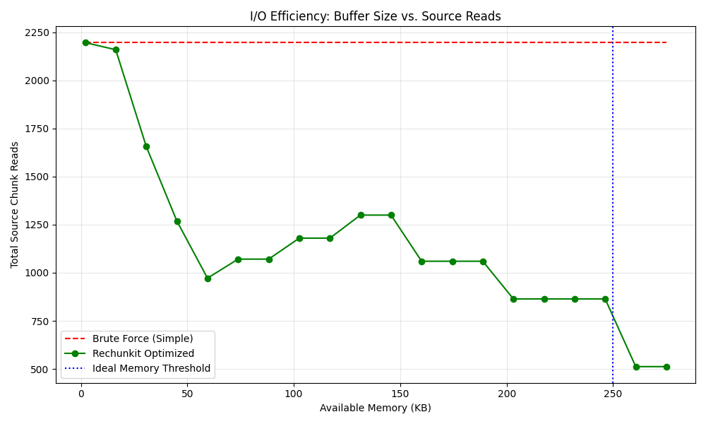
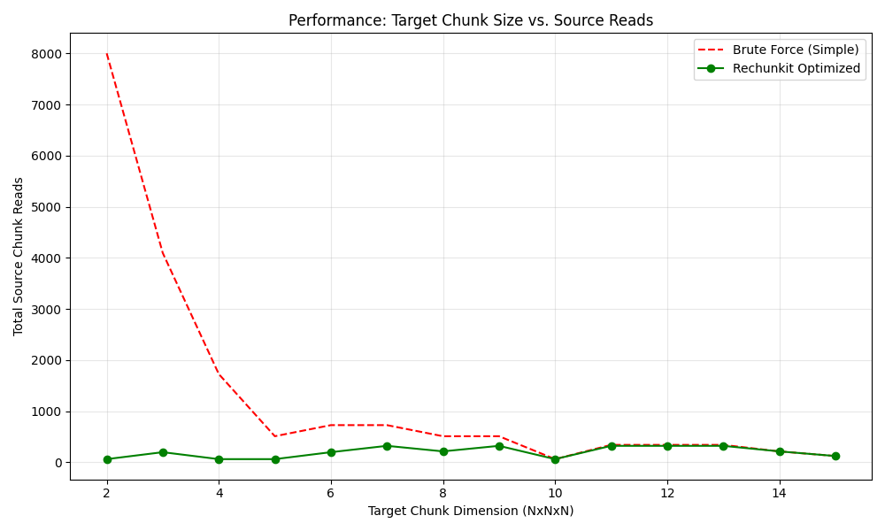

# How It Works

rechunkit uses a two-tier algorithm to minimize the number of source chunk reads during rechunking. The key insight is that reading source chunks in groups — rather than one per target chunk — avoids redundant I/O.

## The LCM Read Group

When rechunking from source chunks of shape `(6, 4)` to target chunks of shape `(4, 6)`, the element-wise Least Common Multiple is `(12, 12)`. A buffer of this size is the smallest block that is an exact multiple of both chunk shapes, so every source chunk within the block maps cleanly to target chunks without overlap outside the block.

```
Source chunks (6×4)        Target chunks (4×6)
┌──────┬──────┐            ┌────┬────┬────┐
│      │      │            │    │    │    │
│      │      │            ├────┼────┼────┤
│      │      │            │    │    │    │
├──────┼──────┤            ├────┼────┼────┤
│      │      │            │    │    │    │
│      │      │            └────┴────┴────┘
└──────┴──────┘
    LCM block: 12×12
```

Within one LCM block, each source chunk is read exactly once, and each target chunk is written exactly once.

## Two Paths

### Ideal path

When the LCM block fits in `max_mem`, rechunkit uses the **ideal path**:

1. Iterate over the array in LCM-sized groups
2. Read all source chunks in the group into a single buffer
3. Extract and yield all target chunks from the buffer

Every source chunk is read exactly once — the minimum possible.

### Constrained path

When `max_mem` is too small for the LCM block, rechunkit uses the **constrained path**:

1. Compute a reduced read shape that fits in memory (a multiple of the source chunk shape, preserving the aspect ratio of the ideal shape)
2. Iterate over target chunks in order
3. For each target chunk, read the overlapping source chunks into the buffer
4. When the buffer covers multiple target chunks, yield them all to avoid redundant reads later

Some source chunks may be read more than once, but the algorithm minimizes this. The more memory available, the fewer redundant reads.

The choice of buffer shape within the memory budget affects how many redundant reads occur. rechunkit uses a candidate search to find the buffer shape that minimizes read count — see [Optimization Internals](optimization-internals.md) for details on the algorithm and trade-offs.

## Memory vs. Reads

The relationship between `max_mem` and read count is monotonic — more memory always means fewer or equal reads:

| Buffer size | Reads per source chunk | Path |
|-------------|----------------------|------|
| ≥ LCM block | Exactly 1 | Ideal |
| Between source and LCM | 1–N (depends on alignment) | Constrained |
| ≈ Source chunk | Maximum redundancy | Constrained |

You can use `calc_n_reads_rechunker` to find the exact read count for any memory budget before running the rechunker.

## Performance Benchmarks

### I/O Efficiency: Buffer Size vs. Source Reads

Increasing `max_mem` reduces redundant reads. The naive approach (shown for comparison) always performs the maximum number of reads regardless of memory.



### Scalability: Target Chunk Size vs. Source Reads

When target chunks are small or misaligned, the naive approach's read count grows rapidly. rechunkit's buffered reads keep the count near-constant.


