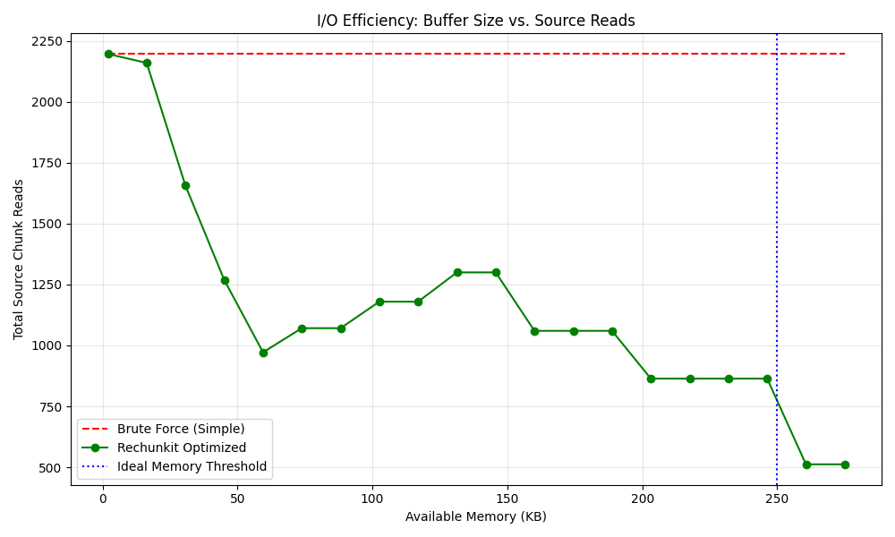
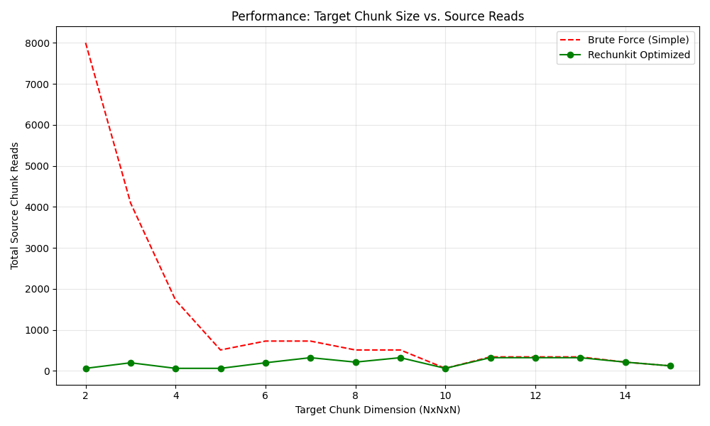

# How It Works

rechunkit uses a two-tier algorithm to minimize the number of source chunk reads during rechunking. The key insight is that reading source chunks in groups — rather than one per target chunk — avoids redundant I/O.

## The LCM Read Group

When rechunking from source chunks of shape `(6, 4)` to target chunks of shape `(4, 6)`, the element-wise Least Common Multiple is `(12, 12)`. A buffer of this size is the smallest block that is an exact multiple of both chunk shapes, so every source chunk within the block maps cleanly to target chunks without overlap outside the block.

```
Source chunks (6×4)        Target chunks (4×6)
┌──────┬──────┐            ┌────┬────┬────┐
│      │      │            │    │    │    │
│      │      │            ├────┼────┼────┤
│      │      │            │    │    │    │
├──────┼──────┤            ├────┼────┼────┤
│      │      │            │    │    │    │
│      │      │            └────┴────┴────┘
└──────┴──────┘
    LCM block: 12×12
```

Within one LCM block, each source chunk is read exactly once, and each target chunk is written exactly once.

## Two Paths

### Ideal path

When the LCM block fits in `max_mem`, rechunkit uses the **ideal path**:

1. Iterate over the array in LCM-sized groups
2. Read all source chunks in the group into a single buffer
3. Extract and yield all target chunks from the buffer

Every source chunk is read exactly once — the minimum possible.

### Constrained path

When `max_mem` is too small for the LCM block, rechunkit uses the **constrained path**:

1. Compute a reduced read shape that fits in memory (a multiple of the source chunk shape, preserving the aspect ratio of the ideal shape)
2. Iterate over target chunks in order
3. For each target chunk, read the overlapping source chunks into the buffer
4. When the buffer covers multiple target chunks, yield them all to avoid redundant reads later

Some source chunks may be read more than once, but the algorithm minimizes this. More memory *generally* means fewer redundant reads (see "Memory vs. Reads" below for the precise statement).

When a target chunk's read region exceeds the buffer, the write chunks are handled by the **batched single path**: consecutive target chunks are collected into batches (as many as the memory budget allows), their overlapping source reads are deduplicated, and each source chunk is read once per batch and scattered into per-target-chunk buffers.

The choice of buffer shape within the memory budget affects how many redundant reads occur. rechunkit uses a greedy heuristic plus a small **candidate check** (the greedy shape, a target-aligned snap, a half-budget greedy, and one source chunk are scored by running the planner itself; the fewest-reads shape wins) — see [Optimization Internals](optimization-internals.md) for the history and the 2026-07 revisit.

## Consuming the generator: yielded arrays are ephemeral

The arrays yielded by `rechunker()` may be **views into the internal buffer**, which is reused as iteration advances. Two rules follow:

1. **Consume or copy each yielded array before advancing the generator.** Holding references across iterations (e.g. `list(rechunker(...))`) leaves some arrays pointing at overwritten buffer memory — silently wrong data. Whether a given chunk happens to be a view or a copy depends on plan internals you cannot see, so never rely on it.
2. **Treat yielded arrays as read-only.** Mutating one in place can corrupt data yielded later.

The supported pattern is to process (write out, aggregate, or `.copy()`) each chunk inside the loop body:

```python
for write_slices, data in rechunker(source, shape, dtype, src_cs, tgt_cs, max_mem):
    target[write_slices] = data          # consumed immediately — safe
```

## Memory vs. Reads

Read count *generally* decreases as `max_mem` grows, but it is **not guaranteed monotone**: read shapes are discrete multiples of the source chunks and the planner switches between regimes (ideal / constrained-bulk / batched) at thresholds, so a larger budget can occasionally cost a few percent more reads. The candidate check suppresses the worst cases (a pinned regression sweep caps observed jumps at well under 2x), but no formal guarantee exists.

| Buffer size | Reads per source chunk | Path |
|-------------|----------------------|------|
| ≥ LCM block (clipped to the array extent) | Exactly 1 | Ideal |
| Between source and LCM | 1–N (depends on alignment) | Constrained |
| ≈ Source chunk | Once per batch of target chunks | Batched single |

`max_mem` is an honest TOTAL: it bounds the read buffer plus the canonical-order pending copies plus the batch buffers. The exceptions are the irreducible floors (you cannot read less than one source chunk nor materialize less than one target chunk) and the wide-array residual: when a single source chunk spans multiple target-chunk rows on a wide array, the pending band `(ceil(src0/tgt0) - 1) x row_width x itemsize` is physically unavoidable without re-reading every source row band per target row — rechunkit holds the band rather than multiply the reads.

You can use `calc_n_reads_rechunker` to find the exact read count for any memory budget before running the rechunker. Note that for constrained plans under ~20,000 target chunks it runs the candidate check (a few extra planning passes); planning stays proportional to the target chunk count.

## Performance Benchmarks

### I/O Efficiency: Buffer Size vs. Source Reads

Increasing `max_mem` reduces redundant reads. The naive approach (shown for comparison) always performs the maximum number of reads regardless of memory.



### Scalability: Target Chunk Size vs. Source Reads

When target chunks are small or misaligned, the naive approach's read count grows rapidly. rechunkit's buffered reads keep the count near-constant.


